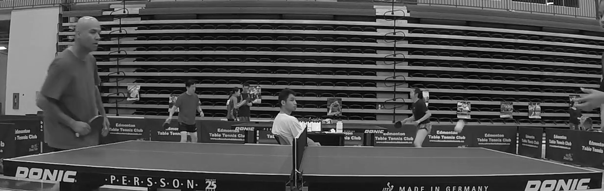
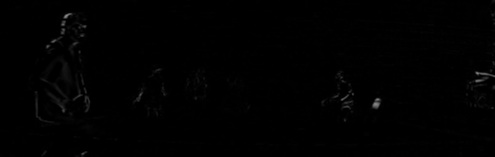
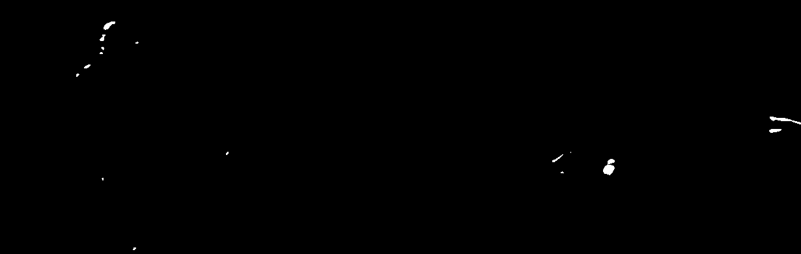
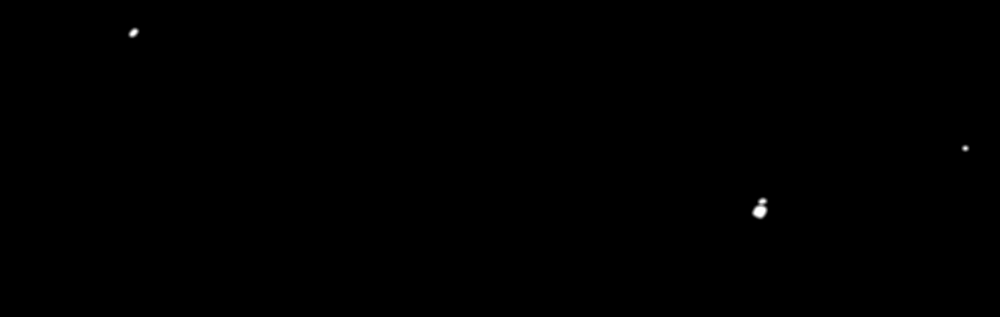
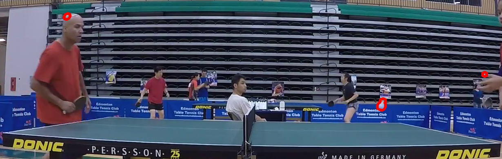

# PongPing


## Description
PongPing is a table tennis scoring system through image processing the live video of the match, where the system
will be able to score points to the competitors and flag a foul when applied.

## List of Contributors
| Names    |      Code     |    Github  |
|----------|:-------------:|:-------------|
| Abdelrahman Wael Helaly |  1500797 | [Helaly96](https://github.com/Helaly96)     |
| Ammar Yasser |   1500866  | [Ayasser96](https://github.com/AmmarYasser97)   |
| Mohamed Hesham | 1501320 | [MHesham98](https://github.com/MHesham98)       |
| Omar Ibrahim | 1500869 |   [mr-rofl](https://github.com/mr-rofl)   |
| Omar Ahmad | 1500873 |     [omarahmad293](https://github.com/omarahmad293)   |

## Features
1. Ball detection
2. Stadium Segmentation
3. Scoring System
4. Ini Configuration File
5. Debugging Console

## Demo


## Development Environment & Dependencies 
##Development Environment & Dependencies:
In our development we used python language with some dependencies:
* OpenCV: To process the video
* PyQT: To make the GUI
* Numpy: To define arrays
* Shapely: To help in the scoring systems

PongPing built with some magic python libraries, so before start using PingPong run the following command

### Cloning

```bash
git clone https://github.com/Helaly96/ImageProcessing-PongPing.git
git cd /ImageProcessing-PongPing
```


### Installation of dependencies

After install the dependancies, next step is cloning PongPing.
```bash
pip install opencv-python pyqt5 puqt5-tools numpy shapely
```

### Usage
Then run our GUI
```bash
python gui.py
```

## Ball Tracking
To track the ball, a pipeline of stages had to be done:
1. Convert the image to grayscale

2. Subtract current frame from previous one

3. Blur the image witha gaussian blur

4. Threshold the image

5. Open the image

6. Blur the image witha gaussian blur

7. Detect the contours

8. Sort and filter the contours

9. Select one of the contours to be the current trajectory

## Stadium Segmentation
## Scoring System
## Ini Configuration
## Debuging Console

## Previous Development Approaches
1. [Trajectory & Kalmann filter]()
2. [Search for white contours in contours list]()
3. [Tweaking Video parameters]()
4. [Coloring the ball]()


## Contributing
Pull requests are welcome. For major changes, please open an issue first to discuss what you would like to change.
