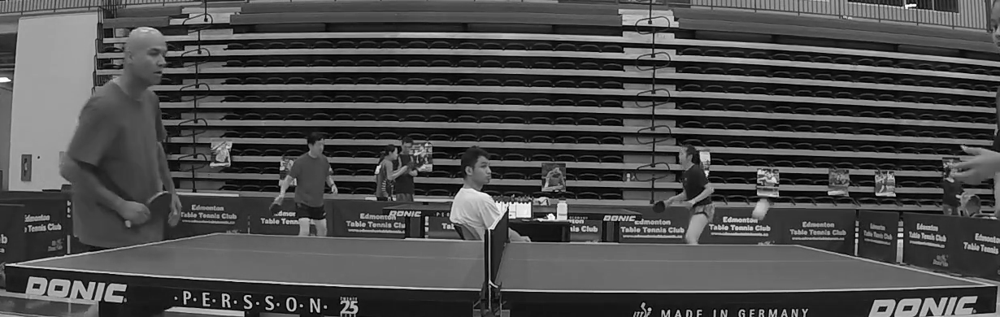
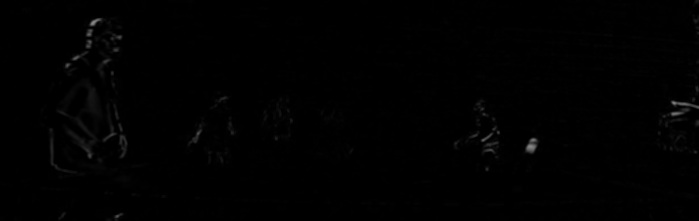
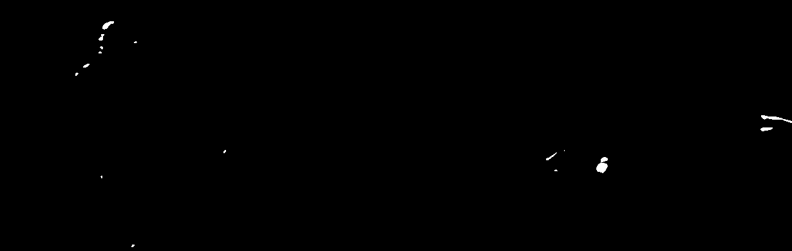
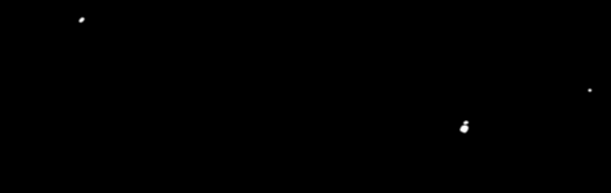
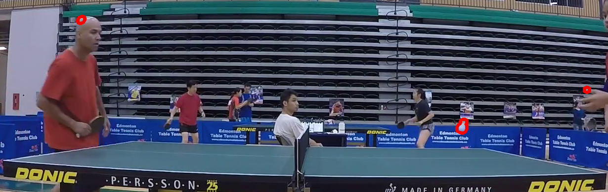

# PongPing

*Delivery Note : For a full list of commits and timeline, please check Prediction Branch*

## Description
PongPing is a table tennis scoring system through image processing the live video of the match, where the system
will be able to score points to the competitors and flag a foul when applied.

## List of Contributors
| Names    |      Code     |    Github  |
|----------|:-------------:|:-------------|
| Abdelrahman Wael Helaly |  1500797 | [Helaly96](https://github.com/Helaly96)     |
| Ammar Yasser |   1500866  | [Ayasser96](https://github.com/AmmarYasser97)   |
| Mohamed Hesham | 1501320 | [MHesham98](https://github.com/MHesham98)       |
| Omar Ibrahim | 1500869 |   [mr-rofl](https://github.com/mr-rofl)   |
| Omar Ahmad | 1500873 |     [omarahmad293](https://github.com/omarahmad293)   |

## Features
1. Ball detection
2. Stadium Segmentation
3. Scoring
4. Ini Configuration File
5. Debugging Console

## Demo


## Development Environment & Dependencies 
In our development we used python language with some dependencies:
* OpenCV: To process the video
* PyQT: To make the GUI
* Numpy: To define arrays
* Shapely: To help in the scoring systems

PongPing built with some magic python libraries, so before start using PingPong run the following command

### Cloning

```bash
git clone https://github.com/Helaly96/ImageProcessing-PongPing.git
git cd /ImageProcessing-PongPing
```


### Installation of dependencies

After install the dependancies, next step is cloning PongPing.
```bash
pip install opencv-python pyqt5 puqt5-tools numpy shapely
```

### Usage
Then run our GUI
```bash
python gui.py
```

## Ball Tracking
To track the ball, a pipeline of stages had to be done:
1. Convert the image to grayscale

2. Subtract current Documentation-Images from previous one

3. Blur the image with a gaussian blur

4. Threshold the image

5. Apply Opening on the image

6. Blur the image with a gaussian blur

7. Detect the contours

8. Sort and filter the contours

9. Select one of the contours to be the current trajectory


## Stadium Segmentation
First we let the user select an approximate area of the stadium then we loop for a number of
frames to decrease the error just in case a player was hiding a part of the stadium or any other 
error in this loop we save the resulted frames from masking using a color filter in a list then 
we loop on this list to select the frame having the largest contour -having the largest
contours indicates segmenting the stadium better-.
At this point we've got the contours for the stadium, then we find the contours for the net and
eventually we draw those contours on the video.
[Stadium Segmentation Illustration](https://www.youtube.com/watch?v=hd54ugIYpQw&feature=youtu.be "Video")


## Scoring System
Integration of Four Classes is responsible to monitor the game using the inputs from both the Ball Tracking and Stadium Segmentation.

### Class Ball
Class responsible of tracking the ball position and direction throughout the game

### Class tableObject
Class responsible to create the polygon of either the stadium table or the net to be used in the calculations needed.

### Class Player
Class responsible to hold the players score, serve count, let allowance.

### Class Match
Class responsible to integrate between all the previous classes to monitor the matches and govern the main logic of the ping pong game.

## Ini Configuration
it serves as the connection between all the helper funcutions and the main gui code, for example, the stadium segmentation outputs the stadium points and the net, and it's saved in this configuration file.
so simple the gui files check if these points are there, so it doesn't need to re-run the same fun. and proceeds with main algorithm.

in order read from the .ini files, we defined an API class for the gui to use it.

## Debuging Console

## Previous Development Approaches

1. [Optical Flow Approach](https://github.com/Helaly96/ImageProcessing-PongPing/blob/Prediction/OpticalFlow-Algo/OptialFlow.py)

  We tried to use the [Lucas Kanade](https://docs.opencv.org/master/db/d7f/tutorial_js_lucas_kanade.html) Algorithm to detect the ball in the beginning, we tried it on a raw video and it gave the resullt you  can check [Here](https://www.youtube.com/watch?v=LkEs04UhJJ4), and it was sensitive to noise so we naturally filtered out the video and was able to make the optical flow algorithm detect the ball, but again if the ball was out sight or just simply fast enough to skip the windows the algorithm searches in , we won't be able to get it again. so that's we we didn't choose that algorithm
  
2. [Blob Detection](https://github.com/Helaly96/ImageProcessing-PongPing/blob/Prediction/Algorithms-Tryout/Blob-Detection.py)

after we decided to filter out the ball using color ; we would be left with white spots where the ball is true, so naturally we decided to build on the simple color detection and using [BlobDetection](https://www.learnopencv.com/blob-detection-using-opencv-python-c/) we would then filter out circular shapes, but came few problems when trying this algorithm, first problem was that the ball isn't always exactly spherical when shot with high speed so there goes the convexity filteration and secound of all that the ball isn't consistenly white, different lightning affects the ball HSV values, so that's we didn't settle on using it.

3. [Motion Detection using MOG2]()

Before settling on using subtract or absdifferece , we started using MOG2 and MOG, it performed better in some videos , worse in others.
you can see the result of MOG2 [here](https://www.youtube.com/watch?v=QXrxQLreJkg).
so we saw potiential in it and that lead to the very first pipeline we [used](https://github.com/Helaly96/ImageProcessing-PongPing/tree/52eca968f5a8e866f52dee231ba23c63a89c0db5) which basically depended on us finding all moving objects with MOG2 and then following that with white color detection using hsv and following by some contour constrains (length and area) and for a result from this approach you can check this [video](https://youtu.be/zDyQDUTYPz0)
but we didn't use it in the end, MOG2 was also extremely sensitive to noise, and we couldn't debug in it because it was kinda a black box so we googled on how it operates and found this amazing [answer](https://stackoverflow.com/questions/52578621/best-opencv-algorithm-for-detecting-fast-moving-ball) on stackoverflow that kickstarted the journey with absdiff and subtract

4. [Color of area enclosed in contours]()


## How can this be extended

well, this serves as a demo for a school project, so of course it's not perfect and there is always room for improvement.. one of them is using kalman fiters to predict the ball's position, we studied this approach mathematically but we didn't come to implementing it, which would significally improve the results.

## Contributing
Pull requests are welcome. For major changes, please open an issue first to discuss what you would like to change.
